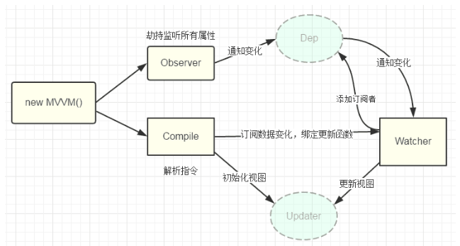

MVVM原理

要实现MVVM需要有一个compile、一个observe、一个watcher

1、compile指令解析，通过扫描dom树 找到需要替换的节点、根据指令进行对应的替换更新、绑定对应的更新函数   

2、observe 对对象的所有属性进行监听 如有变动通知Dep进行upadte   

3、watcher 连接compile和observe 能够订阅到每个属性的变动、并通知到compile进行View层的更新

